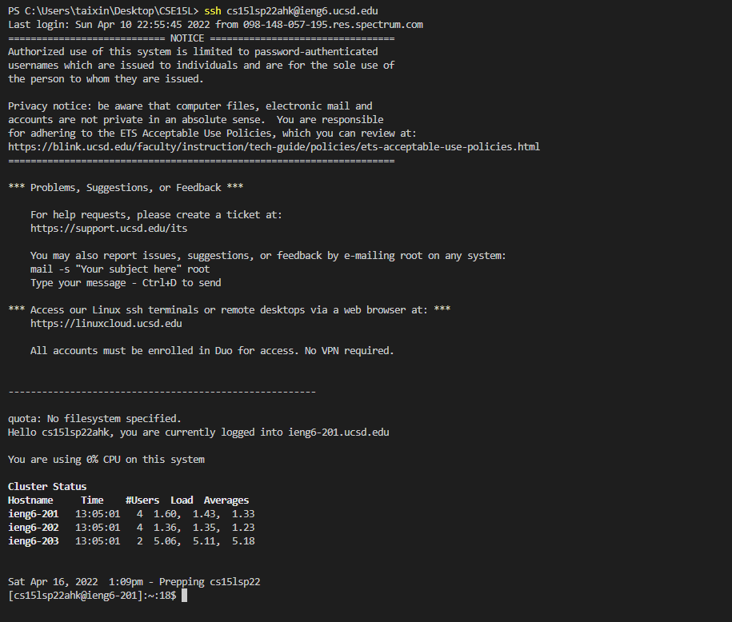

# Week 2 Lab Report

## Installing VScode

Download the VScode from https://code.visualstudio.com/

Follow the instruction

## Remotely Connecting

* Install OpenSSH:
https://docs.microsoft.com/en-us/windows-server/administration/openssh/openssh_install_firstuse

* Look up account for CSE15L: 
https://sdacs.ucsd.edu/~icc/index.php

Run 'ssh cs15lsp22ahk@ieng6.ucsd.edu' in terminal:

## Try Some Commands

Try commands ls, ls -lat:

## Move Files with scp

use 'scp' command to copy WhereAmI.java from local computer to SSH server

run ls to make sure it is in the server:

## Setting an SSH Key

>Step 1: ssh-keygen

>Step 2: ssh-keygen -t ed25519

>Step 3: copy key to .ssh directory

Note: I already have the file, so i can't create directory '.ssh'

>**The expected result are shown bellow:**

## Optimizing Remote Running

1. locally edit file WhereAmI.java
2. In client, run 'scp', move eidted file to SSH server
3. Run multiple command to compile and run WhereAmI.java while login 'ssh'. 

