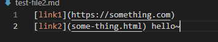

# The Lab Report 2<br />
<br />

 Require: Show three code on the given code
<br />

## First bug

File cause bug:
<br />



<br />

Code to fix:
<br />

```
if (openBracket == -1) {
    break;
}
```
<br />


<br />

Symptom before fixed:

<br />

 

<br />

For the .md file that does not end with a link, this bug occurs. 

CurrentIndex will go back to -1 after all the links found. While loop is now `(currentIndex < markdown.length())`. After `currentIndex = closeParen + 1;` run, currentIndex become 0 which continue the while loop and run into infinity loop. 


<br />
<br />

## Second bug
<br />

File cause bug:
<br />


<br />
<br />

Code to fix:
<br />

```
if (closeBracket == -1) {
    break;
}
```
<br />


<br />

Symptom before fixed:

<br />

 

<br />

For the .md file that does not end with a valid link, this bug occurs. 

Similar reason as test-file2, this bug cause infinite loop. 

<br />
<br />


## Third bug
<br />

File cause bug:
<br />


<br />
<br />

Code to fix:
<br />

```
if (closeParen == -1) {
    break;
}
```
<br />


<br />

Symptom before fixed:

 

<br />
For the .md file that does not have valid link address, this bug occurs. 
Which is caused by the index out of bound exception since the input doesn't have a ")" to close and cause miscalculation. 

<br />
<br />

The End:
---

**Thank you for you time.** <br/>
## **Have a nice day.** <br/>
