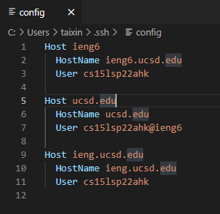
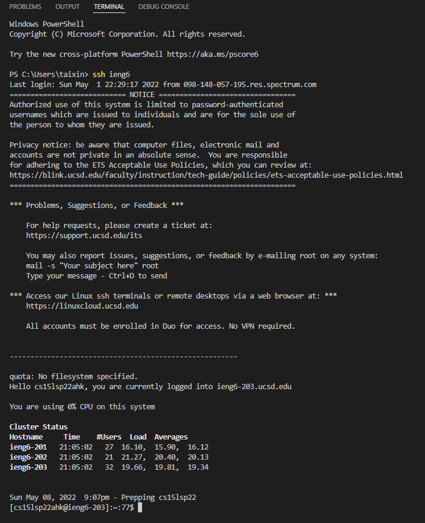
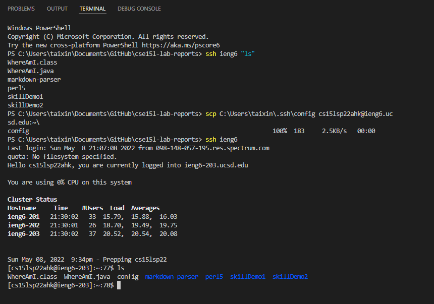
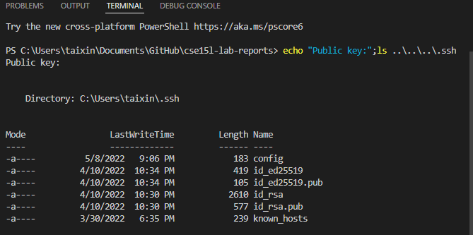
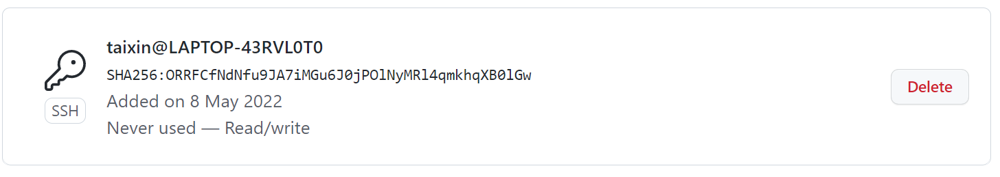
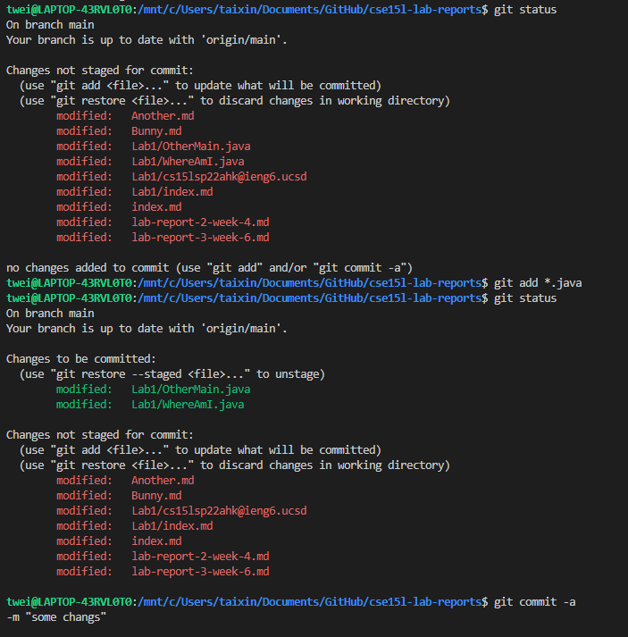
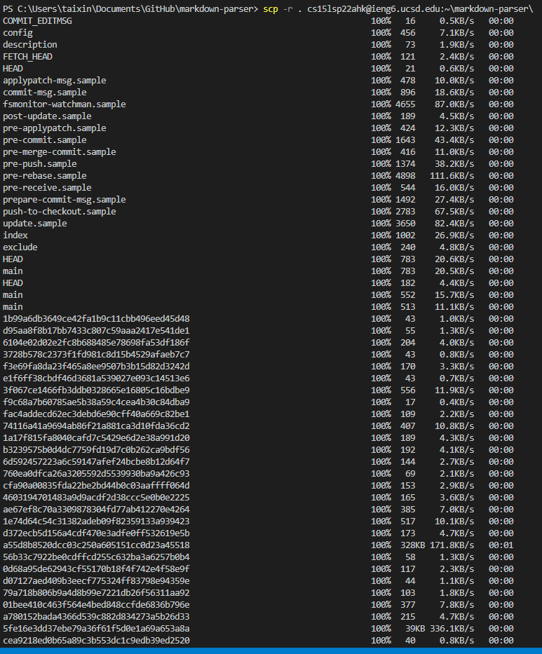

# Lab Report 3 (Week 6)


## Streamlining SSH Configuration

To easily log into the SSH server, we will be using a configuration file to refer to the SSH keys. This file will be stored in the `.ssh` directory in our home directory.

The basic format of this file is as follows:

```txt
Host *
  User username
  Hostname hostname.com
  IdentityFile ~/.ssh/id_rsa
```

The *Host* refers to the section of the file that contains the information for a specific host. The *User* refers to the username that we will be using to log into the host. The *Hostname* refers to the hostname of the host we are connecting to. The *IdentityFile* refers to the location of the SSH key that we will be using to log into the host.




After setting up the config file, if you run the command `ssh {host}` you will be prompted for your password (unless you set up [passwordless access](https://atlae.github.io/cse15l-lab-reports/lab-report-1-week-2.html)). You should get something look similar in the following picture:



Now we try to use an **scp** command to copy a file to the account. You will see following:


Note that paths may look a little different on Windows compare with other system, windows use \ instead of / . 

## Setup GitHub Access from ieng6

We want to clone and pull from the repository on the remote server so our life will be easier. We will use the `git` command to do this. 

W need to authenticate GitHub to do this which requires a [token-based login](https://docs.github.com/en/authentication/connecting-to-github-with-ssh/adding-a-new-ssh-key-to-your-github-account) mechanism that work like SSH keys.

This is the public key in local:



This is the private key in local:


This is public token on GitHub:



Commit with the token:



The commit reflected on GitHub:

[Commit](https://github.com/Atlae/markdown-parse/commit/8e9c28d033f6e877b6fcc6f6f19fc81f3df55f42)


## Copy whole directories with `scp -r`

We want to run the [markdown-parse] repository on the ieng6 server.

The first step is copy the whole directory to the server. 


Note:  `-r` copy the whole directory *recursively*.


Next, we run the tests on the server. We will be using the `make test` command after using our newly streamlined SSH process to login.


Of course, we want to do this in one line, because we're cool like that. B)


