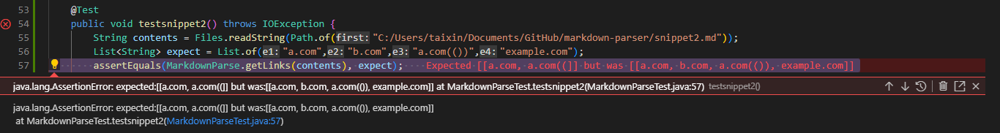

# CSE 15L - Week 8 Lab report 4
## Markdown Parse Tests
- - -
> Overview: Review two Markdown parse.
 3 implementations were made to each file to discover issues.

Repo links to the MarkdownParse files:

[MarkdownParse 1](https://github.com/taixinw/markdown-parser)

[MarkdownParse 2](https://github.com/richmass1/markdown-parser)

- - - 
### Snippet 1

The expected result for this implementaion: <br/>


Snippet1 test in the MarkdownTest file:
```
    @Test
    public void testsnippet1() throws IOException {
        String contents = Files.readString(Path.of("C:/Users/taixin/Documents/GitHub/markdown-parser/snippet1.md"));
        List<String> expect = List.of("url.com","`google.com","google.com","ucsd.edu");
        assertEquals(expect,MarkdownParse.getLinks(contents));
    }

```
### **Test Output**
#### MarkdownParse 1


Failed because I didn't consider the case for brackets inside of a name for a link. To fix this issue need a big change (>10 lines code change) is needed. 
Need to have a loop to search for the last close bracket. Locate the index of the last close bracket.
Check if there are open parenthesis is on the next index. <br/>


#### MarkdownParse 2 (Reviewed)


- - -
### Snippet 2
The expected result for this implementaion:  <br/>


Snippet2 test in the MarkdownTest file:
```
    @Test
    public void testsnippet2() throws IOException {
        String contents = Files.readString(Path.of("C:/Users/taixin/Documents/GitHub/markdown-parser/snippet2.md"));
        List<String> expect = List.of("a.com","b.com","a.com(())","example.com");
        assertEquals(MarkdownParse.getLinks(contents), expect);
    }

```
### **Test Output**

#### MarkdownParse 1 


Failed because I didn't consider parenthesis can be inside the link.
To fix this problem, a small change of code is needed. 
 After find the open parenthesis, search for the las parenthesis and return the text bewteen them.

#### MarkdownParse 2 (Reviewed)


- - - 
### Snippet 3

The expected result for this implementaion:<br/>


Snippet3 test in the MarkdownTest file:
```
    @Test
    public void testsnippet3() throws IOException {
        String contents = Files.readString(Path.of("C:/Users/taixin/Documents/GitHub/markdown-parser/snippet3.md"));
        List<String> expect = List.of(" https://www.twitter.com","https://ucsd-cse15l-w22.github.io","github.com","https://cse.ucsd.edu/");
        assertEquals(MarkdownParse.getLinks(contents), expect);
    }

```
**Test Output**

#### MarkdownParse 1 


Failed because I didn't consider the case that a link inside another link.
To fix this problem, a big change of code is required. 
Possible solution: after find the open parenthesis, check inside, if there are ".com" inside, return the string that connected to ".com" and ignore the other texts.


#### MarkdownParse 2 (Reviewed)


