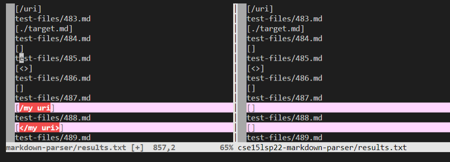
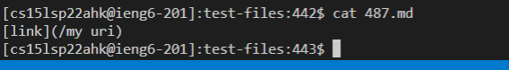
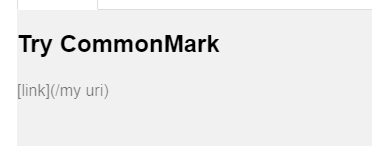
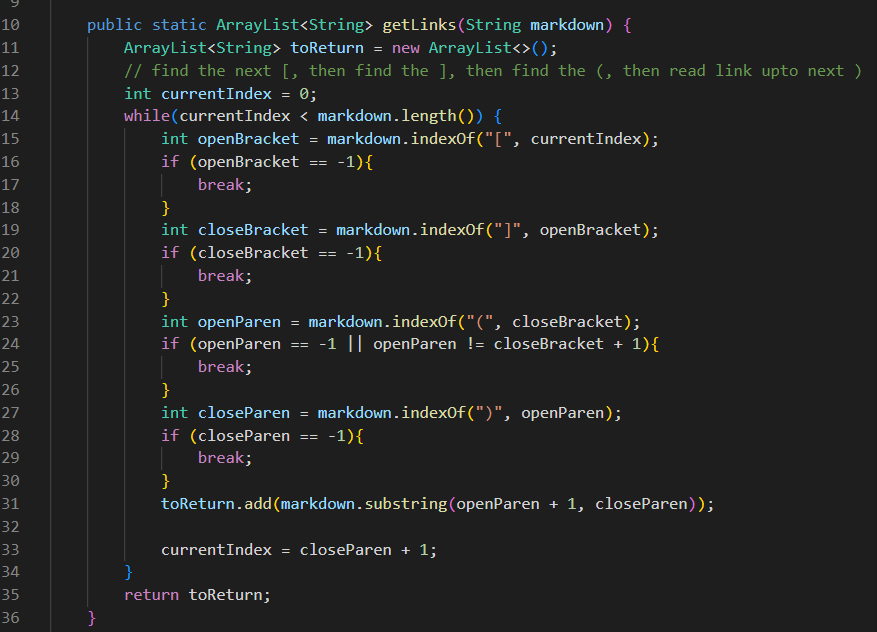
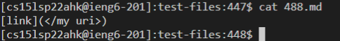
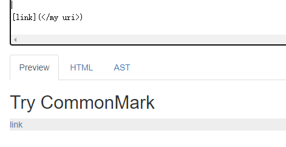
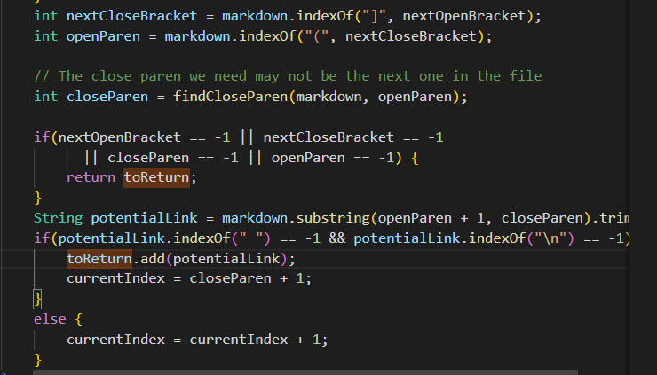

<div style="text-align:center;background-color:#e0ffff;">
    <p style="font-family:Times New Roman;font-size:60px" > <b>CSE15L lab 5</b></p>
    <p style="color:blue;font-style:italic;font-size:20px"> Finding the difference and debugging</p> 
</div>

> Run all test files use the code shown below:

```
for file in test-files/*.md;
do
  echo $file
  java MarkdownParse $file
done
```

> The code above in `script.sh` can run the program on all `.md` files in the `test-files` directory. The command `bash script.sh > results.txt`, let us store all outputs in the `results.txt` file. 

> Use the following command to compare two files:

```
diff <Path A> <Path B> 
```

I compare use the command `vimdiff markdown-mdparse/results.txt markdown-parse/results.txt` :




> The highlighted part tell us which lines and the content are different. Tests with different results are shown here.  

> In this lab report, I will discuss `test 487` and `test 488` here.

# Difference 1

> we take a look at `test 487` first,
use command `cat 487.md` :



> According to [the CommonMark demo site](https://spec.commonmark.org/dingus/), this should not be a link:




The expected output should be `[]`. because `/my uri` is not a valid link. The provided code seen to give the right output.
I think my implementation failed because I didn't check if there are break for the link after `/`.  

> Part of the implementation in my markdown-parse:




> To fix the problem in the above picture of codes, I can add an if-statement to check if there are `''`(space) on the contents after `/`.
If there are breaks, I just return `[]` .

# Difference 2

> we take a look at `test 488` now,
use command `cat 488.md` :



> According to [the CommonMark demo site](https://spec.commonmark.org/dingus/), this should not be a link:




I am suspecting this is not a valid link becuase it can't take me to a valid website, but since the `the CommonMark demo site` show it is link, I will treat it as a link. 
In that case, my implementation is right and the given code is wrong. 

> Part of the implementation in given markdown-parse:




> To fix the problem in the above picture of codes, I think the problem is that the code didn't check `<` and `>`, so if we add if-statement to get the string between `<` and `>`, it will give the right output. 